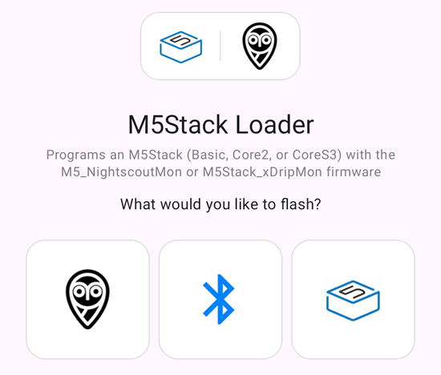
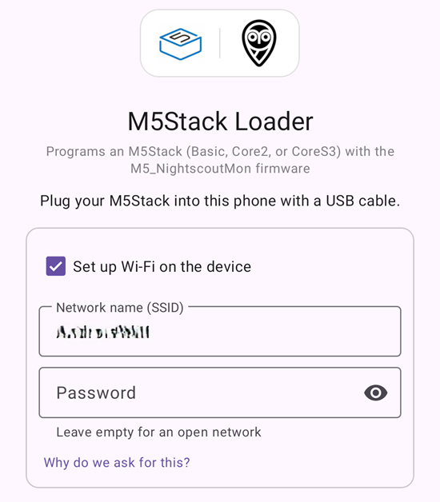
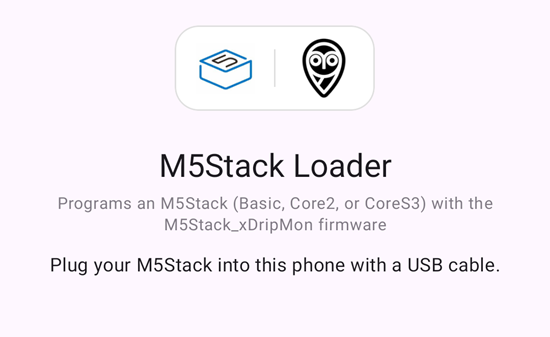
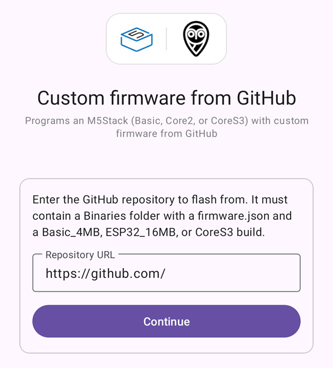

# M5Stack Loader

## ⚠️ Disclaimer

**This app was built almost entirely by an LLM coding assistant** (Claude, via Claude Code) —
the flashing protocol implementation, the UI, and this document. A human (the repo owner)
directed the work, reviewed the changes, and tested it against real M5Stack hardware, but the
code has not had an independent security or safety audit.

Flashing overwrites the bootloader-level firmware of a physical device. A failed or
interrupted write can leave it unbootable, and while the app includes a ROM-bootloader
fallback and MD5 verification specifically to guard against that, no software guarantee is
absolute. **Use it at your own risk.** It is provided with no warranty of any kind — see
[`LICENSE`](LICENSE). If something looks wrong, please open an issue rather than assuming the
code is correct because an AI wrote it.

## What it does

An Android app that flashes firmware onto an M5Stack over USB with as little fuss as
possible: plug the device into the phone, confirm what was found, tap **Flash**. The app
works out which M5Stack you have, downloads the matching binaries, and burns them — you never
pick a model or a file.

When it opens you choose what to flash:



### 1. Nightscout monitor (Wi-Fi)

Flashes [M5_NightscoutMon](https://github.com/psonnera/M5_NightscoutMon), which reads your
glucose data over Wi-Fi. Because it needs a network, this mode can also write your phone's
Wi-Fi credentials into the device as part of the same flash, so it joins your network on
first boot with no manual setup on the device itself. The SSID is prefilled from the network
the phone is on; leave the box ticked to provision it, or untick it to flash firmware only.



### 2. xDrip monitor (Bluetooth)

Flashes [M5Stack_xDripMon](https://github.com/psonnera/M5Stack_xDripMon), which talks to xDrip
over Bluetooth. It needs no network, so this mode flashes firmware only — there is no Wi-Fi
step. Plug in the device and flash.



### 3. Custom firmware from GitHub

Flashes any GitHub repository laid out like the two above — a `Binaries` folder with a
`firmware.json` manifest and `Basic_4MB`, `ESP32_16MB`, or `CoreS3` builds. Paste the repo
URL and continue; the app checks the `main` then `master` branch for a usable manifest before
flashing. Because this firmware is not reviewed by the Nightscout/xDrip projects, the app
warns you and asks you to confirm before it writes anything.



## How to use it

1. Plug the M5Stack into the phone with a USB-OTG cable or adapter. Android offers to open
   M5Stack Loader — allow it (tick "use by default" to skip this prompt next time). If it
   doesn't prompt, open the app manually with the device attached.
2. Choose what to flash: **Nightscout monitor (Wi-Fi)**, **xDrip monitor (Bluetooth)**, or
   **Custom firmware from GitHub** (paste the repository URL and continue).
3. For Nightscout only, optionally fill in your Wi-Fi network name and password (the app tries
   to prefill the SSID from what the phone is currently connected to). Leave the checkbox on to
   have those credentials written to the device; tap "Why do we ask for this?" for the privacy
   details — they never leave the phone except onto the device over USB. The xDrip and custom
   modes have no Wi-Fi step.
4. The app resets the device into its bootloader, identifies the model and flash size, and
   fetches the matching firmware build (cached after the first run, re-validated against the
   server on later ones).
5. Check the model and firmware shown, then tap **Flash**. A progress bar and a scrollable
   log show what's happening; don't unplug the device while this runs.
6. The device reboots into the firmware — you can unplug it. If you set up Wi-Fi (Nightscout),
   the app looks for it on the network by its unique mDNS name (`m5ns-xxxx.local`, `xxxx`
   derived from the device's MAC address) and checks that its on-device config page answers;
   if so, it offers to open that page in your browser.

## How it decides what to flash

It asks the chip itself rather than trusting the USB descriptor, then maps the answer onto
the three builds in the repository's `Binaries/firmware.json`:

| What the chip reports | Build | M5Stack model |
|---|---|---|
| ESP32, 4MB flash | `Basic_4MB` | Basic up to 2020.5 (no PSRAM) |
| ESP32, 16MB flash | `ESP32_16MB` | Basic 16MB/v2.7, Fire, all Core2 |
| ESP32-S3 | `CoreS3` | CoreS3 |

Offsets come from the manifest, not from this source, so the app stays correct if the
firmware author moves one. (They are not the same across models: the CoreS3 bootloader
lives at `0x0`, the ESP32 ones at `0x1000`.)

Anything else — an 8MB ESP32, an unknown chip — is refused rather than guessed at.

## Requirements

- Android 9 (API 28) or newer, with USB host support
- A USB-OTG cable or adapter
- An internet connection the first time (binaries are then cached)

## Building

```sh
./gradlew assembleDebug          # app/build/outputs/apk/debug/app-debug.apk
./gradlew installDebug           # to a connected phone
./gradlew testDebugUnitTest      # protocol + manifest tests
```

## How it works

The app speaks Espressif's serial bootloader protocol directly:

- **Serial** goes through [usb-serial-for-android](https://github.com/mik3y/usb-serial-for-android),
  which covers the CP2104 and CH9102 bridges on the Basic/Fire/Core2. The CoreS3 has no
  bridge — the ESP32-S3 drives USB itself and appears as a CDC device — so that VID/PID is
  registered explicitly.
- **Reset into the bootloader** uses the classic DTR/RTS dance on bridged boards. The CoreS3
  needs a different sequence, because its USB-Serial/JTAG peripheral must never see both
  lines low at once.
- **Flashing** uploads Espressif's flasher stub into RAM and drives it at 921600 baud,
  writing zlib-compressed 16KB blocks. If the stub refuses to start, it falls back to the
  ROM bootloader, which is slower but works. Every image is verified by MD5 against the
  device before the app reports success.
- **Wi-Fi provisioning** writes an NVS partition image containing the SSID/password, and a
  `device_name` derived from the chip's MAC address (read over the bootloader protocol) so
  the device gets a name unique to it, under the `M5NSconfig` namespace M5_NightscoutMon
  reads at boot — no serial console or on-device setup step needed. It's built and flashed
  alongside the firmware, not sent to it afterward.
- **Finding the device afterward** can't rely on its hostname resolving automatically:
  M5_NightscoutMon calls only `MDNS.begin()` — no NetBIOS, no advertised service — so nothing
  Android does out of the box reliably turns `m5ns-xxxx.local` into an IP. The app sends its
  own one-shot mDNS query from an ephemeral port, which obliges the device to answer by direct
  unicast (RFC 6762 §6.7) — no multicast reception needed, which phone Wi-Fi chips often drop.
  It tries the device's derived name first, then falls back to the legacy shared `m5ns.local`
  name for devices still running older firmware.
  If that query goes unanswered it also tries the system resolver before giving up, and the
  app's log says which path found the device.
- **Firmware caching** re-validates each cached binary with a conditional HTTP request
  (ETag) rather than trusting "present on disk", since the firmware repository's `master`
  can gain new commits under an unbumped version string.

`EspLoader` has no Android dependencies, so it is tested on the JVM against `FakeEspRom`, an
in-memory bootloader that inflates the blocks it is sent and answers MD5 with a digest of
what it actually decoded. A fault in the framing, checksums, block splitting or compression
fails those tests.

## Licence and credits

GPL-3.0-or-later, matching M5_NightscoutMon. Full text in [`LICENSE`](LICENSE).

`EspLoader.kt` is a derivative of **Boris du Reau's [Java ESPLoader](https://github.com/bdureau/ESPLoader)**
(GPL-3.0) — the original Java port of esptool — reworked for Android, with register
layouts, reset sequences and framing rules from **[espressif/esptool](https://github.com/espressif/esptool)**
(GPL-2.0-or-later). Espressif's flasher stubs are redistributed verbatim (Apache-2.0), and
[usb-serial-for-android](https://github.com/mik3y/usb-serial-for-android) (MIT) is packaged
into the APK.

Full attribution, including the licence texts these works require to be carried with the
software, is in [`THIRD-PARTY-NOTICES.md`](THIRD-PARTY-NOTICES.md).

## Donations

You liked this utility? Don't hesitate to donate to the [Nightscout Foundation](https://www.nightscoutfoundation.org/donate), to sponsor real developers (unlike me) and fantastic projects.
